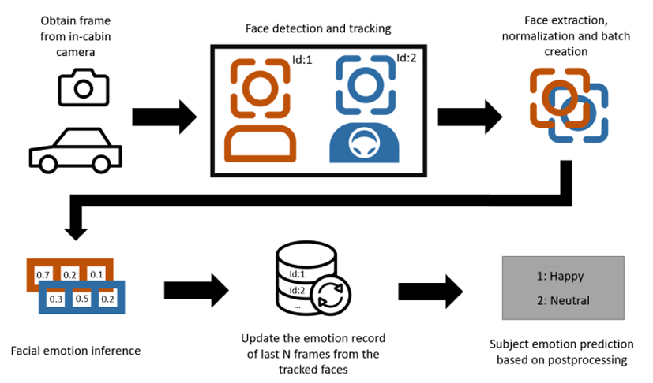
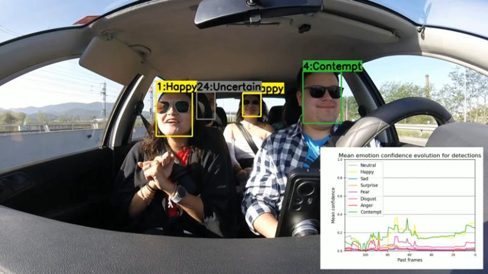

Development of machine learning models for facial emotion recognition as an in-cabin monitoring system for automated mobility
==============================
Nowadays exists a huge resistance towards using Autonomous Driving or Advanced Driver Assistance Systems while driving a car, for both young and elderly drivers and occupants. For this reason, the main goal of the project is a Proof of Concept of an In-Cabin Monitoring System that can measure the people’s emotions. This way, other car modules can use this information to adapt the driving style or cabin environment to make the travel much more comfortable and expectantly, engage people to use more these systems.

This repository contains all the code wrote for developing the project. If model weights are required to validate results or try ir, please ask me! :)

All the investigation has been performed in the context of the European Commission working group CCAM (Connected Cooperative Automated Mobility) in NTT Data and UPC as an academic investigation with non-commercial uses for my final Thesis in the Degree in Data Science and Engineering. Follow this [link](https://upcommons.upc.edu/handle/2117/411482) for more information: 

In-Cabin Monitoring System (ICMS) approach:
==============================

First, an in-cabin camera will be recording a set/all passengers and driver inside the vehicle. Per each 
frame, a face tracking algorithm will be applied to capture each face in the frame (object detection) 
and then relate the detected faces with other detected faces in previous frames (tracking). Afterwards, 
each face is extracted and normalized (performing image normalization and image up-scaling or 
downscaling) and all of them are batched to be forwarded to the facial emotion recognition algorithm 
(image recognition). Each detected face in the current frame will have an emotion prediction. But as 
the subject could have the eyes closed or may be a false positive during the face detection, each of 
these predictions update a dictionary that saves per each tracked detection (having a unique id), the 
last N emotion detections. Finally, a postprocessing algorithm is used to predict the emotion per each 
subject for the current frame based on the last N emotion detections. This way, it is expected to reduce 
the noise in the emotion prediction when closing eyes, talking… 

Results:
==============================
The developed Facial Emotion Recognition model is based on a ViT architecture trained with Knowledge Distillation, among other techniques. The resulting FER model even though does not achieve state-of-the-art results in performance, it is very efficient, offering a GPU speedup from 4X to 1.4X and in CPU from 12.3X to 1.9X compared to them. Then it was used a pretrained face detector (YOLOv8) and tracking algorithm (BoT-Sort) to adapt the FER model to an In-Cabin situation.

Video: [link](https://www.linkedin.com/posts/nat%C3%A1n-parra-68313838_sentimentmonitoring-emotionalintelligence-activity-7267081046318305281-AdSR?utm_source=share&utm_medium=member_desktop)
